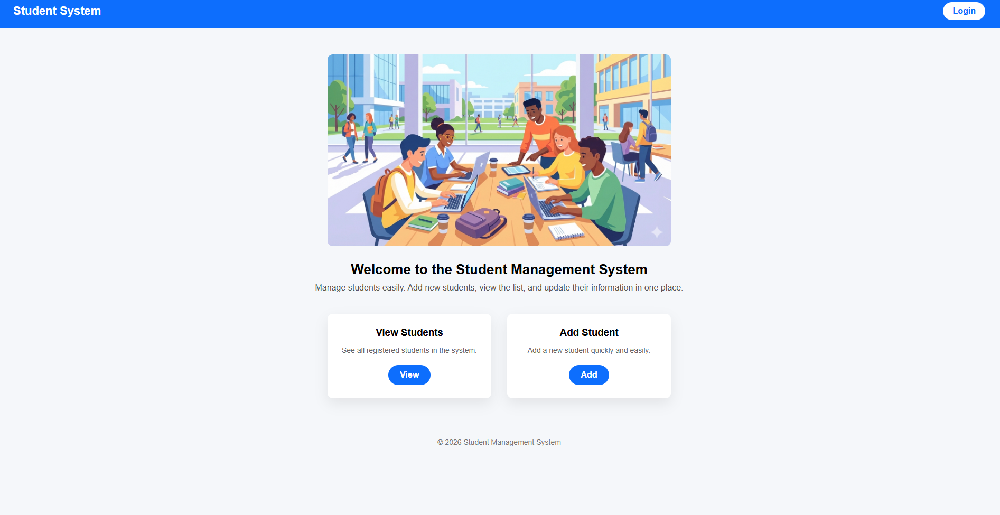
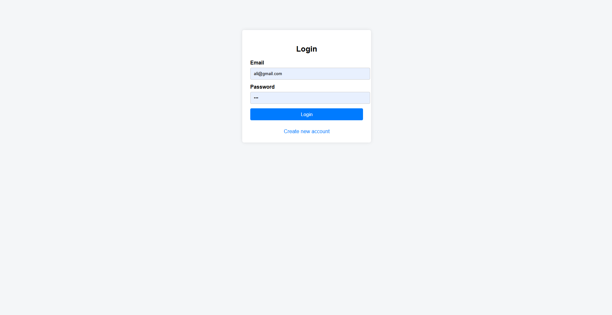
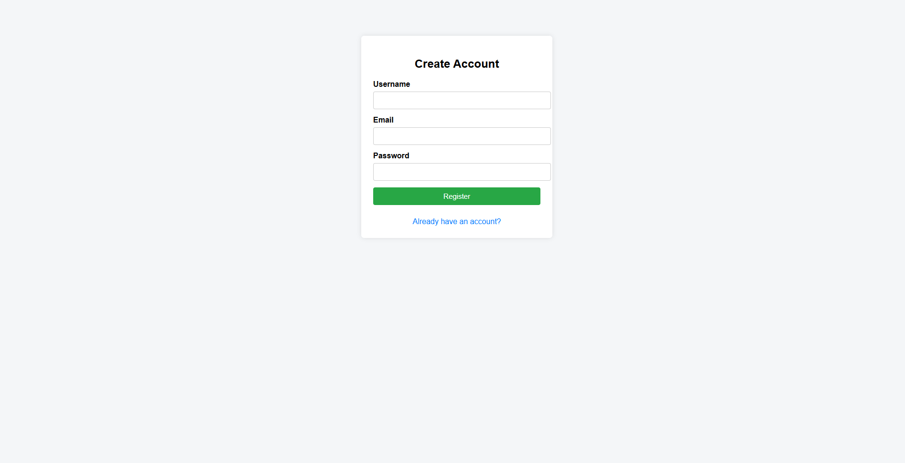
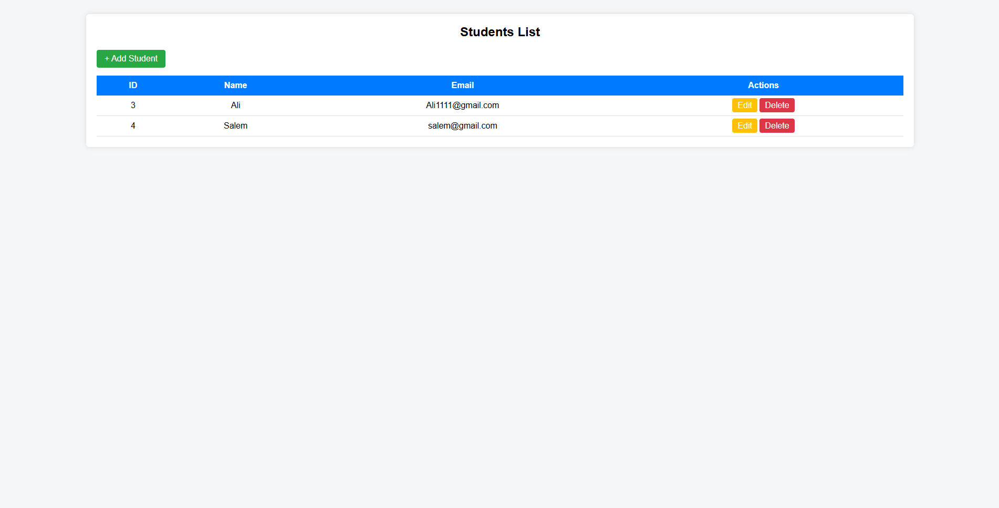
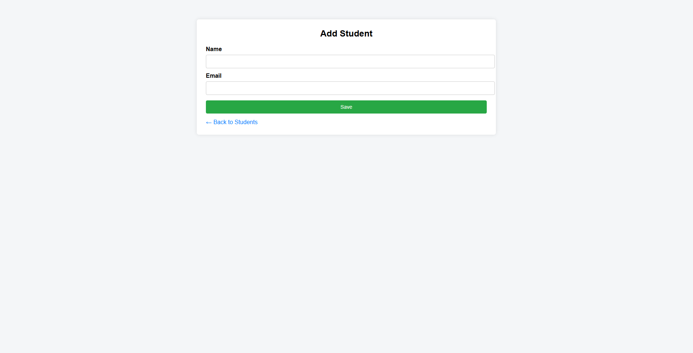

# 🎓 Student Management System

A simple Student Management System developed using **PHP**, **MySQL**, **HTML**, and **CSS**. The system provides user authentication and complete CRUD operations for managing student records.

---

## 📸 Screenshots

### Homepage



---

### Login



---

### Sign Up



---

### Students List



---

### Add Student



---

## ✨ Features

- User Registration
- User Login & Logout
- View Students
- Add Student
- Edit Student
- Delete Student
- MySQL Database Integration
- Responsive Interface

---

## 🛠 Technologies

- PHP
- MySQL
- HTML5
- CSS3

---

## 📂 Project Structure

```
student_system/
│
├── screenshots/
├── add.php
├── edit.php
├── delete.php
├── home.php
├── index.php
├── login.php
├── register.php
├── connection.php
├── student_system.sql
└── README.md
```

---

## ▶️ Installation

1. Copy the project into the **htdocs** folder.

2. Import the database:

```
student_system.sql
```

3. Start **Apache** and **MySQL** from XAMPP.

4. Open your browser:

```
http://localhost/student_system
```

---

## 👨‍💻 Author

**Abdalwahab**
